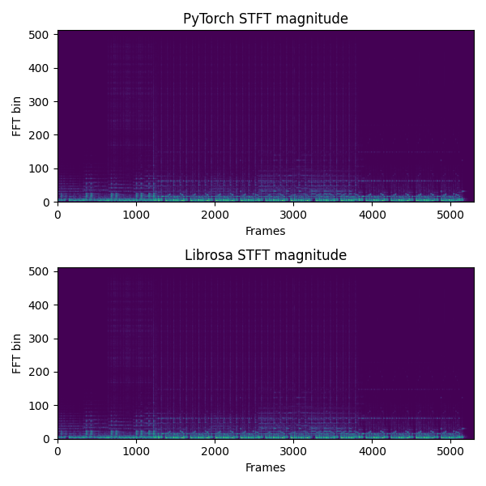

# Conv-STFT/iSTFT in PyTorch
Author: Shimin Zhang

The code refers to the following repo:
1. [remove modulation effects](https://github.com/pseeth/torch-stft) 
2. [enframe and conv-overlap-add](https://github.com/huyanxin/phasen/blob/master/model/conv_stft.py)

An STFT/iSTFT written up in PyTorch(py3) using 1D Convolutions. There are two window logic, `break` and `continue`.

- `break` - a kaldi-like framing method

When the parameters `win_len` and `fft_len` are different, padding `fft_len`-`win_len` zero points after each frame( len(frame) = `win_len` ), and the window ( len(window) = `win_len` ) always wise-multiply with frame before padding.

- `continue` - a librosa-like framing method.

When the parameters `win_len` and `fft_len` are different, framing the signal using `win_len`=`fft_len`, and zero padding on both sides of window ( len(window) = `win_len` ), which is `len(center_pad(window))=fft_len`

## Installation

Install easily with pip:`pip install conv_stft` or download this repo, `python setup.py install`.

## Usage

```python3
import torch
from conv_stft import STFT
import numpy as np
import librosa 
import matplotlib.pyplot as plt

audio = librosa.load(librosa.util.example_audio_file(), duration=10.0, offset=30)[0]
device = 'cpu'
fft_len = 1024
win_hop = 256
win_len = 1024
window = 'hann'

audio = torch.FloatTensor(audio)
audio = audio.unsqueeze(0)
audio = audio.to(device)

stft = STFT(
    fft_len=fft_len, 
    win_hop=win_hop, 
    win_len=win_len,
    win_type=window,
).to(device)

magnitude, phase = stft.transform(audio, return_type='magphase') # 'magphase' or 'realimag'
output = stft.inverse(magnitude, phase, input_type='magphase') # 'magphase' or 'realimag'
output = output.cpu().data.numpy()[..., :]
audio = audio.cpu().data.numpy()[..., :]
print(np.mean((output - audio) ** 2)) # on order of 1e-15
```

Output of [`compare_stft.py`](compare_stft.py):



## Tests
Test it by just cloning this repo and running
    
```
pip install -r requirements.txt
python -m pytest .
```

